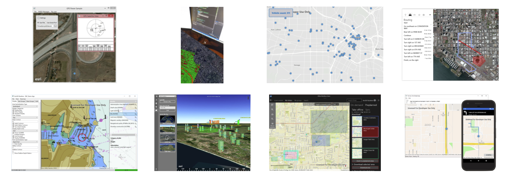

# ArcGIS Runtime SDK for .NET - Demos

**Demo apps showcasing full workflows with ArcGIS Runtime**

## Contents

* [`Symbol Editor`](src/SymbolEditor) - A WPF .NET Core app (and MSIX installer project) shows how to use mobile styles and create/edit vector symbol layers.
* [`Turn-by-Turn Routing`](src/TurnByTurn) - A cross-platform app shows turn-by-turn routing and navigation.
* [`Simple Portal Browser`](src/SimplePortalBrowser) - A cross platform app shows a simple ArcGIS Portal map browser.
* [`Using an External GPS Device`](src/ExternalNmeaGPS) - A Windows Desktop app shows how to use data from an external GPS or NMEA log file to power the MapView's LocationDisplay.
* [`Esri Campus Routing`](src/CampusRouting) - A cross-platform (Xamarin) sample shows indoor geocoding and routing (not using ArcGIS Indoors).
* [`Electronic Navigation Charts (ENC)`](src/HydrographicsSample) - A desktop app shows how to work with and render ENC data using the Hydrographics package.
* [`GeoEvent Server Streaming Service`](src/GeoEventServerSample) - A desktop app shows how to stream data from ArcGIS GeoEvent Server and render that data on a map.
* [`Multi Targeting Project`](src/MultiTargeting) - A single project shows how to use multitargeting to share code with multiple target frameworks supported by ArcGIS Runtime SDK.
* [`Geocode & Route on MouseMove`](src/GeocodeAndRoutingOnMouseMove) - A WPF and UWP app shows fast reverse geocoding and routing as the mouse moves.
* [`Viewshed analysis in tabletop AR with Xamarin.Forms`](src/ViewshedInTabletopAR) - A Xamarin.Forms app shows a viewshed analysis for a moving graphic running in tabletop AR.
* [`Offline workflows`](src/OfflineWorkflowsSample) - A UWP app shows how to browse a portal for offline-enabled maps, take them offline, and open previously downloaded maps.
* [`KML Viewer`](src/KmlViewer) - A UWP app shows how to visualize KML/KMZ files in 2D and 3D.
* [`Editing geometries in a SceneView`](src/SceneViewEdit) - A Windows Desktop app shows how to create a 3D geometry editor.
* [`Measure Tool`](src/MeasureTool) - A UWP app shows how to use Sketch Editor to create a measuring tool.

## Contribute

Anyone and everyone is welcome to [contribute](CONTRIBUTING.md) in the form of issues. We encourage you to submit issues for:

* Bugs you find while using the demos.
* Requests for new demo apps or enhancements to existing demo apps.

## License

Copyright 2014-2022 Esri

Licensed under the Apache License, Version 2.0 (the "License");
you may not use this file except in compliance with the License.
You may obtain a copy of the License at

   https://www.apache.org/licenses/LICENSE-2.0

Unless required by applicable law or agreed to in writing, software
distributed under the License is distributed on an "AS IS" BASIS,
WITHOUT WARRANTIES OR CONDITIONS OF ANY KIND, either express or implied.
See the License for the specific language governing permissions and
limitations under the License.

A copy of the license is available in the repository's [license.txt](license.txt) file.
