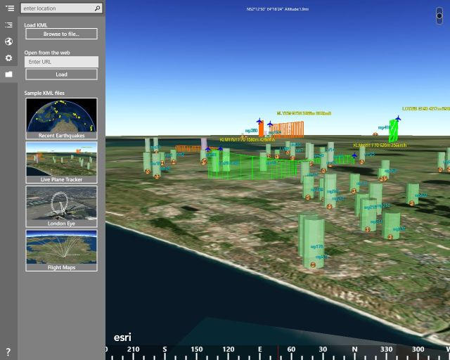
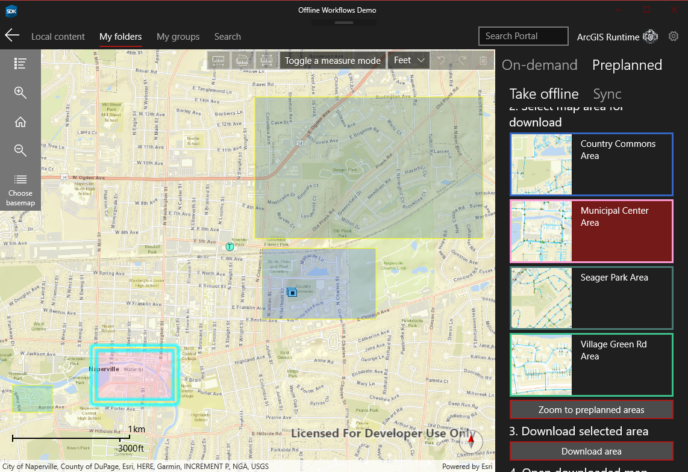

# ArcGIS Runtime SDK for .NET - Demos

 

  

**Full applications demonstrate workflows using ArcGIS Runtime**

<table align="center">
<tr>
<td align="center"></td>
<td align="center"></td>
<td align="center"></td>
<td align="center"></td>

</tr>
<tr>
<td align="center"></td>
<td align="center"></td>
<td align="center"></td>
<td align="center"></td>
</tr>
</table>

## Demos

* [`Symbol Editor`](src/SymbolEditor) - A WPF .NET Core app (and MSIX installer project) that shows using mobile styles, and creating/editing vector symbol layers.
* [`Turn-by-Turn Routing`](src/TurnByTurn) - A universal turn-by-turn app that shows routing and navigation on Windows Desktop, Windows Store and Xamarin.Forms.
* [`Simple Portal Browser`](src/SimplePortalBrowser) - A universal ArcGIS Portal Map Browser app on Windows Phone, Windows Store and Windows Desktop.
* [`Using an External GPS Device`](src/ExternalNmeaGPS) - A Windows Desktop app showing how to use data from an external GPS or NMEA log file to power the MapView's LocationDisplay.
* [`Esri Campus Routing`](src/CampusRouting) - A cross-platform (Xamarin) sample demonstrating indoor geocoding and routing for a campus running on Windows Universal, Android and iOS.
* [`Electronic Navigation Charts (ENC)`](src/HydrographicsSample) - Demonstrates how to work with and render ENC data using the Hydrographics package.
* [`GeoEvent Server Streaming Service`](src/GeoEventServerSample) - Demonstrates how to stream data from ArcGIS GeoEvent Server and render them on the map.
* [`Multi Targeting Project`](src/MultiTargeting) - Example showing how to create a single multi-targeting project that targets all the frameworks that the ArcGIS Runtime SDK for .NET Supports.
* [`Geocode & Route on MouseMove`](src/GeocodeAndRoutingOnMouseMove) - Demonstrates fast reverse geocoding and routing during mouse-move on Windows Desktop (WPF) and Universal Windows Platform (UWP).
* [`Viewshed analysis in tabletop AR with Xamarin.Forms`](src/ViewshedInTabletopAR) - Demonstrates how to do a viewshed analysis in a tabletop AR scenario using a moving graphic with Xamarin.Forms.
* [`Offline workflows`](src/OfflineWorkflowsSample) - Demonstrates how to browse a portal for offline-enabled maps and take them offline. Also demonstrates how to open maps previously taken offline.
* [`KML Viewer`](src/KmlViewer) - A UWP app for visualizing KML/KMZ files in 2D and 3D.
* [`Editing geometries in a SceneView`](src/SceneViewEdit) - A Windows Desktop app demonstrating how to do geometry editing in 3D using a customer editor.
* [`Measure Tool`](src/MeasureTool) - A simple sample demonstrating how to use the editor to create your own measure tool.

## Contributing

Anyone and everyone is welcome to [contribute](CONTRIBUTING.md).

## License

Copyright 2014-2021 Esri

Licensed under the Apache License, Version 2.0 (the "License");
you may not use this file except in compliance with the License.
You may obtain a copy of the License at

   https://www.apache.org/licenses/LICENSE-2.0

Unless required by applicable law or agreed to in writing, software
distributed under the License is distributed on an "AS IS" BASIS,
WITHOUT WARRANTIES OR CONDITIONS OF ANY KIND, either express or implied.
See the License for the specific language governing permissions and
limitations under the License.

A copy of the license is available in the repository's [license.txt](license.txt) file.
