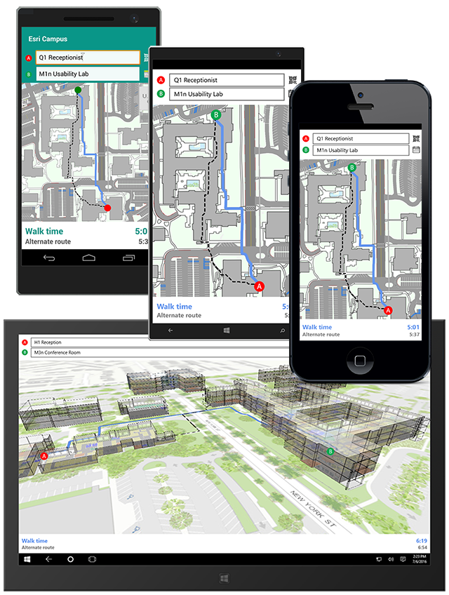

Demo: Esri Campus Routing
=======================
Required version: ArcGIS Runtime SDK 100.0.0 Beta for .NET and Xamarin

This cross-platform sample demonstrates offline* indoor geocoding and routing for a campus.

The app uses Windows Universal and Xamarin to allow running the app on any Windows 10 Device, Android and iOS.
Both a Native platform app as well as a Xamarin.Forms version is provided for each platform.
Most of the code however is in a shared project used by all other projects, so only UI-specific parts are platform specific.

You can also quickly tweak the code to offer a 3D view of the campus* which better visualizes floor changes.

* Note: The 3D version requires an online connection. In addition, while the 2D Map works offline, the app must be online on the first run to provision the data from ArcGIS Online.

	

