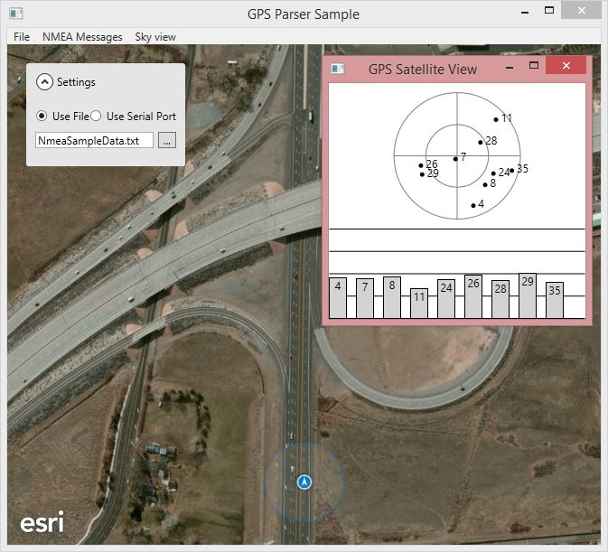

Demo: Using an External GPS Device
=======================
Required version: ArcGIS Runtime SDK 100.7 for .NET

Sample app that shows how to use the [NmeaParser](https://github.com/dotMorten/NmeaParser) library to parse NMEA GPS message from a file or serial port, and use it in a custom LocationProvider to drive the map's LocationDisplay. 

