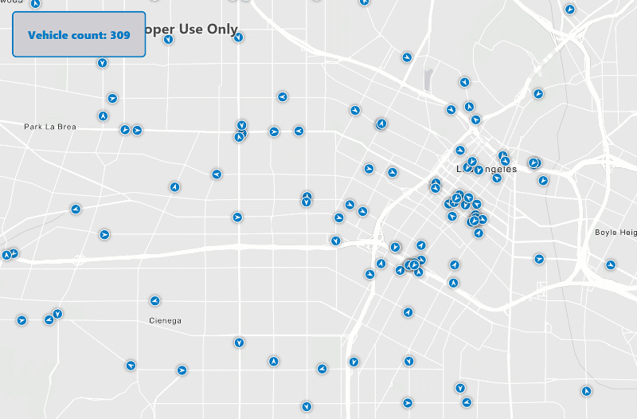

Demo: GeoEvent Server Client
============================
Required version: ArcGIS Runtime SDK 100.2 for .NET / WPF

Demonstrates how to stream data from ArcGIS GeoEvent Server and render them on the map.

