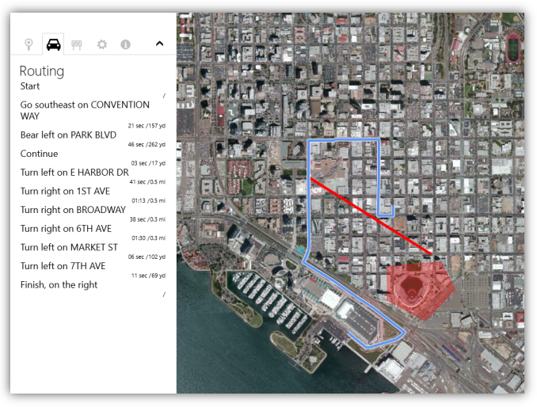
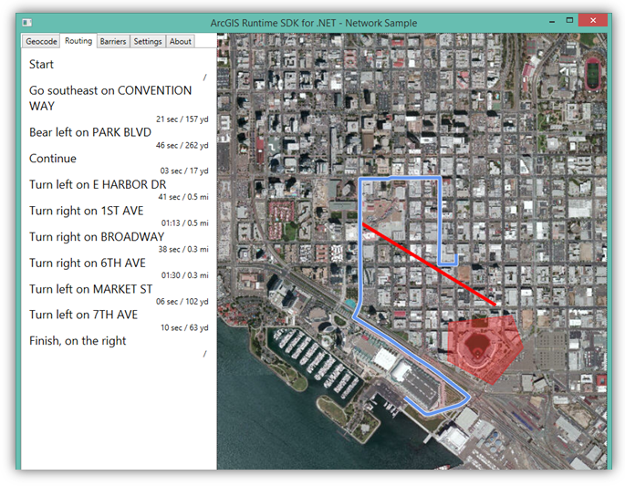

Demo: Geocode & Route on MouseMove
============================
Required version: ArcGIS Runtime SDK 10.2.4 for .NET

Demonstrates fast reverse geocoding and routing on mouse move.
- Supports both online and offline routing and geocoding.
- Both WinStore and WinDesktop sample.
- MVVM - View models are shared for both platforms.
- Separate but similar native-looking views for each platform.

