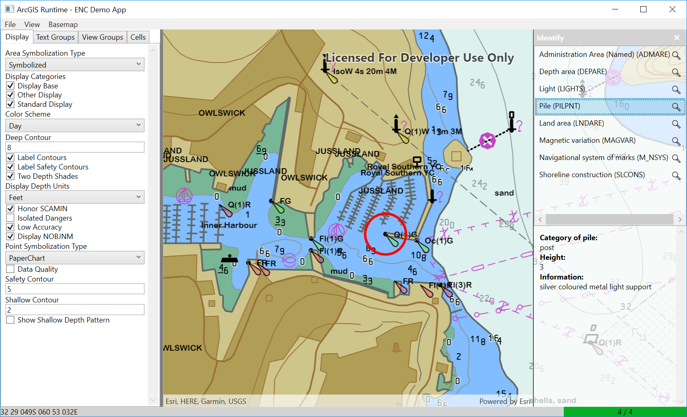

# Electronic Navigation Charts (ENC) Demo

Demonstrates how to work with and render ENC data using the Hydrographics package.

The sample includes a set of "fake" test data for demonstration purposes.
ENC Data can be downloaded from the NOAA website: http://www.charts.noaa.gov/ENCs/ENCs.shtml

