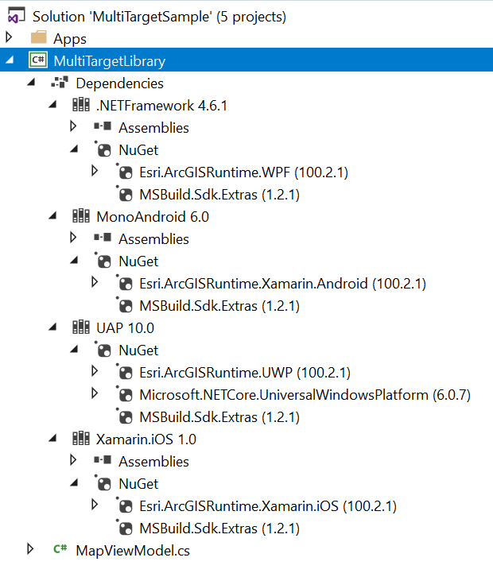

Demo: Multi Targeting Project
============================
Required version: ArcGIS Runtime SDK 100.2.1 for .NET 

Demonstrates how to create a single multi-targeting project that targets all the frameworks that the ArcGIS Runtime SDK for .NET Supports, which can then be referenced by WPF, Windows Universal, iOS, Android and Xamarin.Forms projects.

