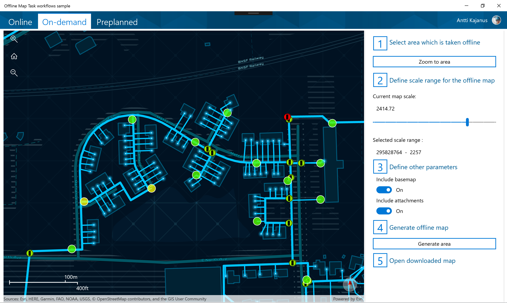

Demo: Offline map workflows
============================
Required version: ArcGIS Runtime SDK 100.2.1 for .NET / UWP

Demonstrates how to use `OfflineMapTask` to take maps offline using on-demand and preplanned workflows. Read more about the workflows from [Create an offline map guide](https://developers.arcgis.com/net/latest/wpf/guide/create-an-offline-map.htm)

This sample was used in [Working with maps online and offline](https://www.youtube.com/watch?v=E2kpUVPnxxg]) presentation in DevSummit 2018.

## On-demand workflow

## Preplanned workflow

