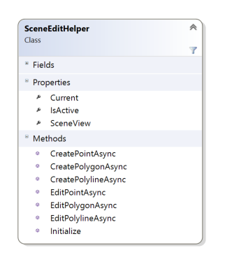
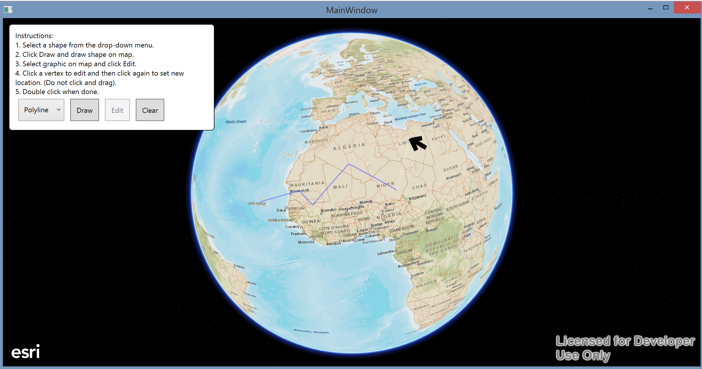
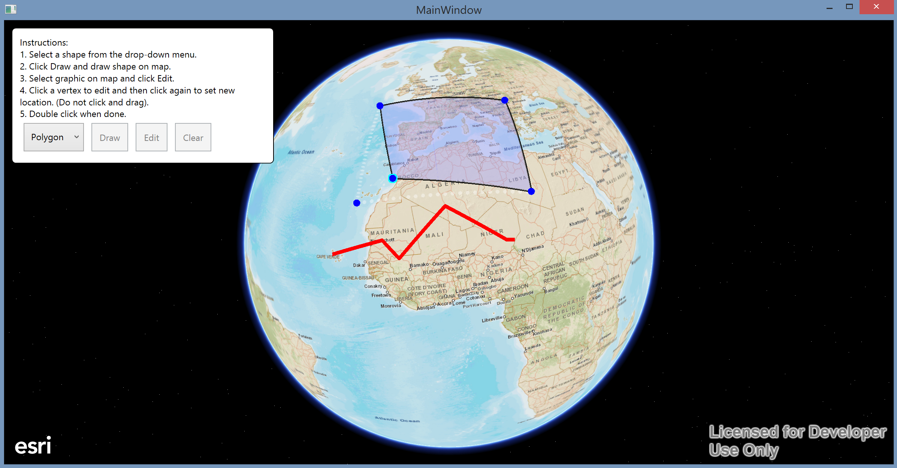

scene editing demo
===============================================

Demo to show how to do custom geometry editing using SceneView. Implements drawing and editing for points, polylines and polygons.

### Notable classes:

* [`SceneEditHelper.cs`](SceneEditingDemo/Helpers/SceneEditHelper.cs) - Provides functions for drawing and editing geometries that works with Graphics and Features
* [`SceneDrawHelper.cs`](SceneEditingDemo/Helpers/SceneDrawHelper.cs) - Provides helper functions for drawing that is used by SceneEditHelper

#### Using SceneEditHelper

`SceneEditHelper` provides methods for creating and editing geometries on a assosiated `SceneView`. You can use the class as-is, extend it or take some ideas from it while implemening your own custom editing experience.

Only one draw or edit operation can be active at the time and preivous is canceled if new one is invoked. You can also use `Cancel` method to cancel ongoing operation. When an operation is canceled `TaskCanceledException` is thrown.

`SceneEditHelper` demo shows editing geometries using Graphics but you can as easily use the same approach with features. If you're using features and you want to save edits back to the service or the local cache, you work with `FeatureTable`s like you normally would do but use `SceneEditHelper` to create or edit their geometries.



#### Drawing geometries

````CSharp
	try
	{
		Geometry geometry = null; 
		Graphic graphic = null;

        // Draw geometry and create a new graphic using it
        switch ((DrawShape)DrawShapes.SelectedValue)
		{
			case DrawShape.Point:
                geometry = await SceneEditHelper.CreatePointAsync(MySceneView);
				graphic = new Graphic(geometry);
				_pointsOverlay.Graphics.Add(graphic);
				break;
			case DrawShape.Polygon:
				geometry = await SceneEditHelper.CreatePolygonAsync(MySceneView);
				graphic = new Graphic(geometry);
				_polygonsOverlay.Graphics.Add(graphic);
				break;
			case DrawShape.Polyline:
				geometry = await SceneEditHelper.CreatePolylineAsync(MySceneView);
				graphic = new Graphic(geometry);
				_polylinesOverlay.Graphics.Add(graphic);
				break;
			default:
				break;
		}
	}
	catch (TaskCanceledException tce)
	{
        // This occurs if draw operation is canceled or new operation is started before previous was finished.
		Debug.WriteLine("Previous draw operation was canceled.");
	}			
````

#### Editing geometries

````CSharp
	try
	{
    	Geometry editedGeometry = null;

        // Edit selected geometry and set it back to the selected graphic
		switch (_selection.GeometryType)
		{
			case GeometryType.Point:
                editedGeometry = await SceneEditHelper.CreatePointAsync(
                    MySceneView);
				break;
			case GeometryType.Polyline:
				_selection.SetHidden(); // Hide selected graphic from the UI
                editedGeometry = await SceneEditHelper.EditPolylineAsync(
                    MySceneView,
                    _selection.SelectedGraphic.Geometry as Polyline);
				break;
			case GeometryType.Polygon:
				_selection.SetHidden(); // Hide selected graphic from the UI
                editedGeometry = await SceneEditHelper.EditPolygonAsync(
                    MySceneView,
                    _selection.SelectedGraphic.Geometry as Polygon);
				break;
			default:
				break;
		}

		_selection.SelectedGraphic.Geometry = editedGeometry; // Set edited geometry to selected graphic
	}
	catch (TaskCanceledException tce)
	{
        // This occurs if draw operation is canceled or new operation is started before previous was finished.
        Debug.WriteLine("Previous edit operation was canceled.");
	}
````




[](Esri Tags: ArcGIS Runtime SDK .NET WinRT WinStore WPF WinPhone C# C-Sharp DotNet XAML MVVM)
[](Esri Language: DotNet)
