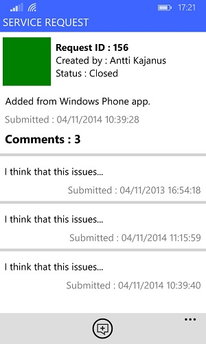

# Demo : Managing service request using Windows Phone app

**Required versions:** ArcGIS Runtime 10.2.4 for .NET, ArcGIS Runtime for .NET 10.2.4 - Toolkit

Sample app that shows how to work with **FeatureService** without using a map. Sample contains following functionalities:

- Query features from FeatureService
- Add features to FeatureService
- Edit features in FeatureService
- Delete features from FeatureService
- Query related records from Table
- Add records to Table
- Delete records from Table

## Used services : 

- [ServiceRequest](http://sampleserver6.arcgisonline.com/arcgis/rest/services/ServiceRequest/FeatureServer/0) : A request for service or incident reported by the general public or other interested party 
- [ServiceRequestComments](http://sampleserver6.arcgisonline.com/arcgis/rest/services/ServiceRequest/FeatureServer/1) : Comment for a service request

## Screenshots

 

## Resources

- [ServiceFeatureTable - class](https://developers.arcgis.com/net/desktop/api-reference//html/T_Esri_ArcGISRuntime_Data_ServiceFeatureTable.htm)
- [Search for Features - guide document](https://developers.arcgis.com/net/desktop/guide/search-for-features.htm)
- [Edit features - guide document](https://developers.arcgis.com/net/desktop/guide/edit-features.htm)

