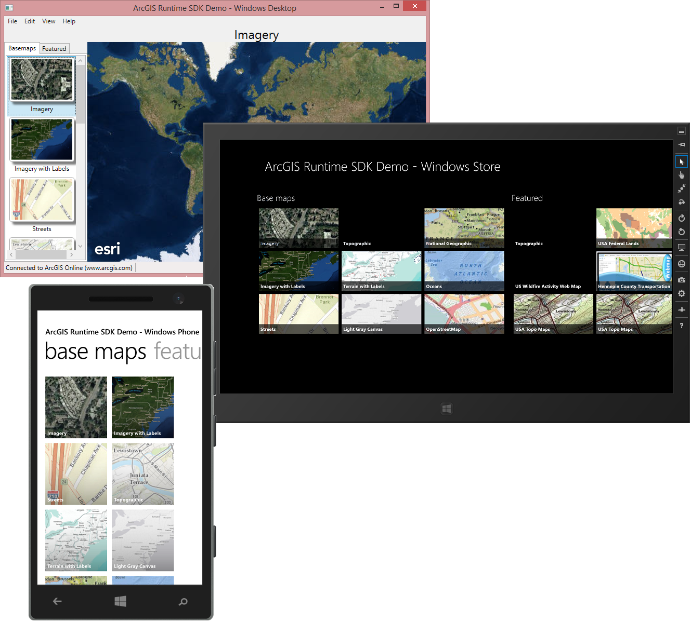

Simple Portal Browser Sample - ArcGIS Runtime for .NET
=======================
Required version: ArcGIS Runtime v10.2.4

Sample app that shows a simple ArcGIS Portal Browser using the [ArcGIS Runtime SDK for Windows Store, Windows Phone and Windows Desktop (WPF) apps](https://developers.arcgis.com/net/). The app uses MVVM patterns and shares the most of the logic between all platforms through a shared project, but uses individual views tailored for the experience on the specific device.

