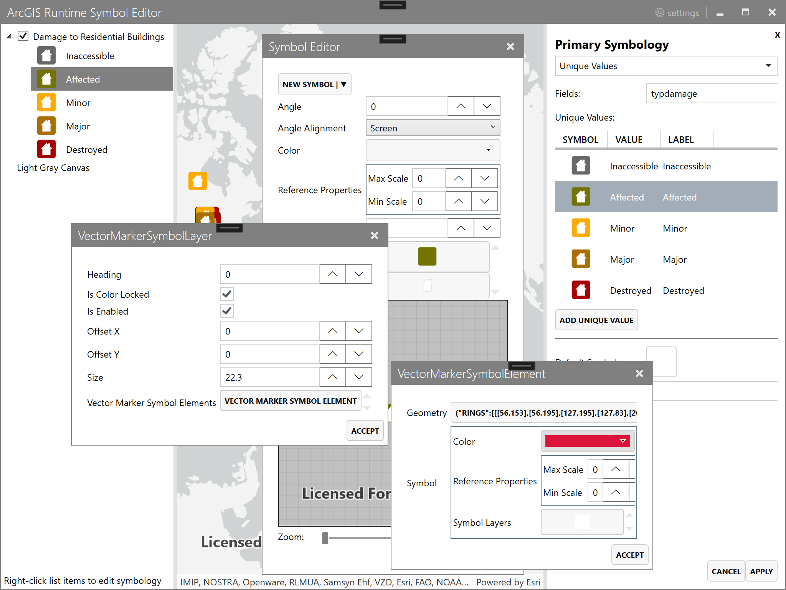

# Symbol Editor

Demonstrates a in-depth symbol editing with a .NET 6 WPF app (with MSIX packaging) using the [ArcGIS Runtime SDK for .NET](https://developers.arcgis.com/net/).

The application uses MahApps.Metro to provide a modern user experience.

