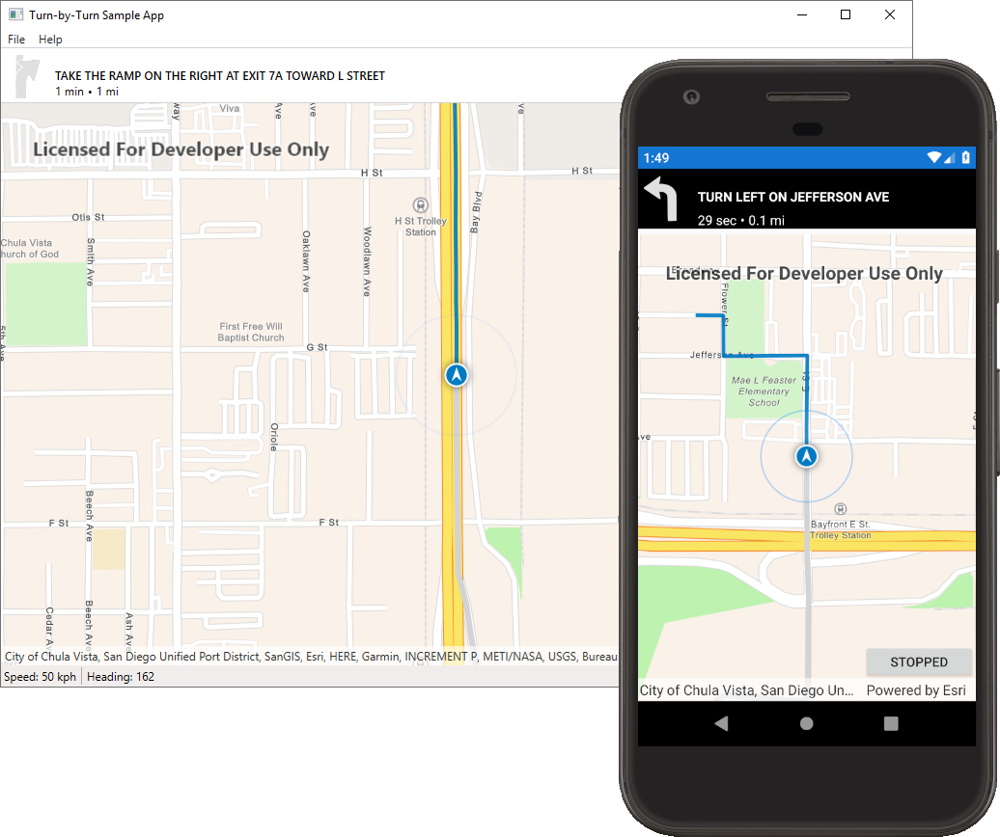

# Demo: Turn-by-Turn Navigation

Required version: ArcGIS Maps SDK for .NET 200.3.0

Sample app that shows how to write a turn-by-turn navigation application using the Network Analysis and Navigation APIs from the [ArcGIS Maps SDK for.NET](https://developers.arcgis.com/net/). The app uses MVVM patterns and shares services, models, and viewmodels between all platforms through a shared project, but uses individual views suited to each specific platform.

## Simulation

The app uses the [`SimulatedLocationDataSource`](https://developers.arcgis.com/net/latest/wpf/api-reference/html/T_Esri_ArcGISRuntime_Location_SimulatedLocationDataSource.htm) to simulate driving from your current location to a selected destination and demonstrate the Navigation API.

## Notable Classes

* [`NavigationService`](RoutingSample.Shared/Services/NavigationService.cs) - Demonstrates how to find a route between two locations.
* [`RestoreAutoPanMode`](RoutingSample.Shared/RestoreAutoPanMode.cs) - Restores the AutoPanMode of the map back to "Navigation" when the map hasn't be touched for a number of seconds - this allows the user to pan and zoom the map, and automatically go back into driving mode.

