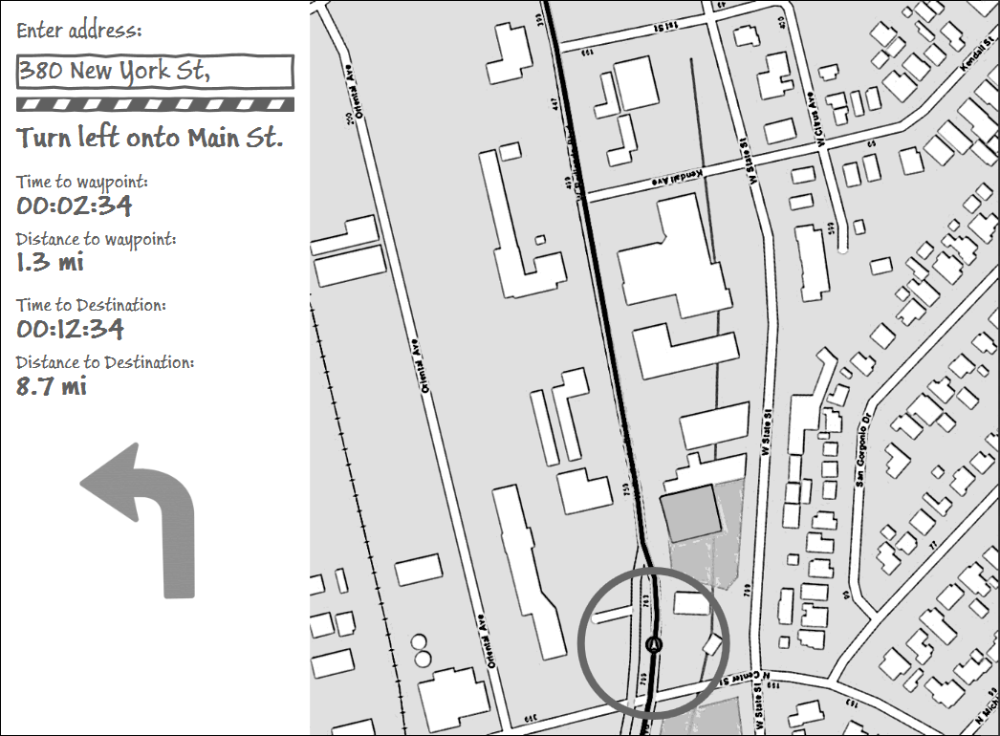

Turn-by-Turn Routing Sample - ArcGIS Runtime for .NET
=======================
Required version: ArcGIS Runtime v10.2.4

Sample app that shows how to write a turn-by-turn routing application using the [ArcGIS Runtime SDK for Windows Store, Windows Phone and Windows Desktop (WPF) apps](https://developers.arcgis.com/net/). The app uses MVVM patterns and shares the services, models and viewmodels between all platforms through a shared project, but uses individual views tailored for the experience on the specific device.

When the app is run in debug mode, it uses a [`Route Location Simulator`](RoutingSample.Shared/RouteLocationSimulator.cs) to simulate driving from your current location to the destination entered. When running the app in release mode, the system's built-in location driver is used.

### Notable classes:
* [`RouteLocationSimulator.cs`](RoutingSample.Shared/RouteLocationSimulator.cs) - A custom location provider for simulating driving along a route.
* [`RestoreAutoPanMode.cs`](RoutingSample.Shared/RestoreAutoPanMode.cs) - Restores the AutoPanMode of the map back to "Navigation" when the map hasn't be touched for a number of seconds - this allows the user to pan and zoom the map, and automatically go back into driving mode.

