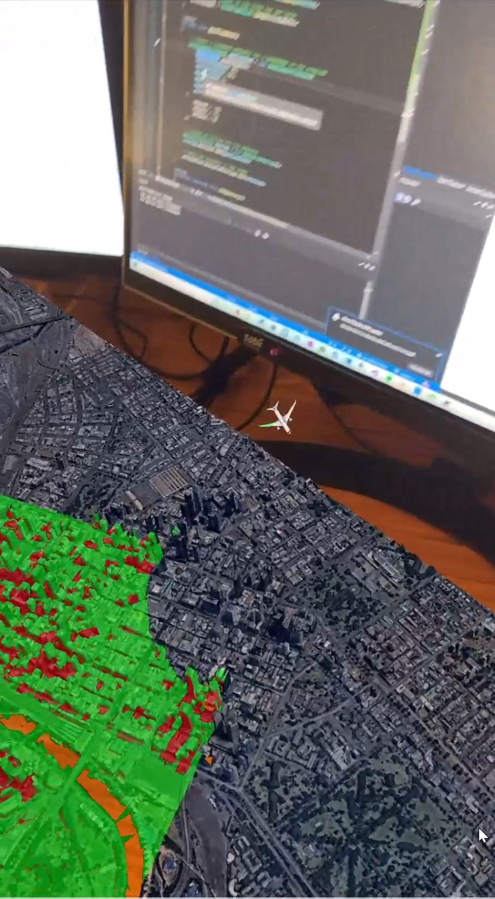

# Demo: Viewshed Analysis in tabletop AR with Xamarin.Forms

This sample demonstrates the following ArcGIS Runtime features:

* AR Toolkit support for Xamarin.Forms
* Convenience property for rendering detected planes
* Tabletop AR (the scene is pinned to a detected surface)
* Render and animate 3D models - the demo shows an airplane circling Melbourne, Australia
* Dynamic viewshed analysis - visualize what is hidden and what is obscured for a passenger in the airplane.



## Walkthrough: implement this demo

### 1. Install the templates for Visual Studio

The first step in creating a new AR application with Xamarin.Forms and ArcGIS Runtime is to [download the templates from the Visual Studio Marketplace](https://marketplace.visualstudio.com/items?itemName=Esri.EsriArcGISRuntimeARTemplates). While you can develop AR applications without the templates, they simplify things like: 

* Specifying the right permissions in **Info.plist** and **AndroidManifest.xml**
* Handling permission requests properly at run time
* Configuring ArcGIS Runtime
* Configuring the projects with the right settings for AR

### 2. Create the app from the template

Once you've installed the templates, open Visual Studio, search for the Xamarin.Forms AR template, and create the project.

Out of the box, the ArcGIS Runtime AR template allows you to tap to place a map of Mt. Everest. This is accomplished by setting the following properties on the `ARSceneView` defined in **ARPage.xaml**:

* `PlanesDetectedChanged` – allows you to prompt the user to place the map once planes are found
* `RenderPlanes` is set to `true`; Runtime provides a common plane rendering implementation. On Xamarin.Android and Xamarin.iOS, you can also choose to use the native SDKs for more control over the appearance of rendered planes
* `GeoViewDoubleTapped` – allows you to anchor the map to where the user double taps

Note the following in **ARPage.xaml.cs**:

* The origin camera on the ARSceneView is set to sea level at Mount Everest. The origin camera is where the 3D map is anchored to the real-world table when you tap-to-place.
* The _translation factor_ is set to 1000. The translation factor is the relationship between movement of the device and the movement of the camera in the virtual 3D scene. A large translation factor allows you to move the device around to see large areas of the scene.
* Inside `DoubleTap_ToPlace`, `SetInitialTransformation` is called on `arSceneView`. If the result is `true`, a plane was found at the tapped location, and rendering has been configured such that the origin camera is anchored to the tapped point. Plane rendering is turned off because it is no longer useful once the map is placed. `InitializeScene` is called to configure the map properly for AR.
* `InitializeScene` creates and shows an imagery layer with elevation and disables the navigation constraint (by default, ArcGIS Runtime prevents you from navigating beneath the surface, which causes problems in AR).

### 3. Show a difference map

For this demo, a city will be more interesting than the mountain range. An [nFrames integrated mesh layer showing Frankfurt, Germany](https://tiles.arcgis.com/tiles/u0sSNqDXr7puKJrF/arcgis/rest/services/Frankfurt2017_v17/SceneServer/layers/0) will be used.

The first step to build this app is to remove the existing code from the `ARPage` constructor and `InitializeScene`:

```csharp
public ARPage() 
{
    InitializeComponent();
} 

private async void InitializeScene()
{
    try
    {
        // TODO: set up the visualization here
    }
    catch (System.Exception ex)
    {
        await DisplayAlert("Failed to load scene", ex.Message, "OK");
        await Navigation.PopAsync();
    }
}
```

Next add the following field to `ARPage`:

```csharp
private MapPoint centerPoint;
```

Finally, update `InitializeScene` and implement `configureScene`:

```csharp
private async void InitializeScene()
{
    try
    {
        // Set the translation factor to allow you to see the whole scene
        // TranslationFactor = scene width / physical table width
        arSceneView.TranslationFactor = 4440.0 / .7;

        // Disable touch interaction
        arSceneView.InteractionOptions = new SceneViewInteractionOptions { IsEnabled = false };

        // Set up the scene
        await configureScene();
    }
    catch { }
}

private async Task configureScene() 
{
    // Create a scene and add the Melbourne layer to it.
    Scene frankfurtScene = new Scene(SceneViewTilingScheme.Geographic);
    frankfurtScene.OperationalLayers.Add(new IntegratedMeshLayer(new Uri("https://tiles.arcgis.com/tiles/u0sSNqDXr7puKJrF/arcgis/rest/services/Frankfurt2017_v17/SceneServer/layers/0")));

    // Show the scene in the view
    arSceneView.Scene = frankfurtScene;

    // Hide the basemap surface since it isn't needed with the mesh layer 
    frankfurtScene.BaseSurface = new Surface(); 
    frankfurtScene.BaseSurface.BackgroundGrid.IsVisible = false;
    frankfurtScene.BaseSurface.Opacity = 0;

    // Always disable the navigation constraint in AR
    frankfurtScene.BaseSurface.NavigationConstraint = NavigationConstraint.None;

    // Load the metadata for the scene and all its layers
    await frankfurtScene.LoadAsync();

    // Get the center of the scene content
    centerPoint = frankfurtScene.OperationalLayers.First().FullExtent.GetCenter();

    MapPoint startingPoint = new MapPoint(centerPoint.X, centerPoint.Y, 0, centerPoint.SpatialReference);

    // Set the origin camera. 
    arSceneView.OriginCamera = new Camera(startingPoint, 0, 90, 0);
}
```

By now, the app allows you to double-tap to place a 3D map of Melbourne on a surface, using 100% cross-platform code in Xamarin.Forms.

### 4. Show an airplane model

The next step is to add an airplane graphic to the scene. First, add a field for the graphic to `ARPage`:

```csharp
private Graphic planeGraphic
```

Next, create a method to set up the airplane graphic:

```csharp
private async Task createAndAddAirplane()
{
    // Create a graphics overlay to show the plane graphic above the ground
    GraphicsOverlay planeOverlay = new GraphicsOverlay();
    planeOverlay.SceneProperties.SurfacePlacement = SurfacePlacement.Relative;
    planeOverlay.SceneProperties.AltitudeOffset = 30 + 1200; 

    // Show the overlay and configure it to render the plane graphic
    arSceneView.GraphicsOverlays.Add(planeOverlay);
    SimpleRenderer renderer3D = new SimpleRenderer();
    // Heading and roll will be automatically set based on the plane graphic's attributes
    renderer3D.SceneProperties.HeadingExpression = "[HEADING]";
    renderer3D.SceneProperties.RollExpression = "[ROLL]";
    planeOverlay.Renderer = renderer3D;

    // Download the plane model and get the path
    await DataManager.DownloadItem("21274c9a36f445db912c7c31d2eb78b7"); 
    string path = DataManager.GetDataFolder("21274c9a36f445db912c7c31d2eb78b7");
    string filePath = Path.Combine(path, "Boeing787", "B_787_8.dae");

    // Create the airplane symbol
    ModelSceneSymbol plane3DSymbol = await ModelSceneSymbol.CreateAsync(new Uri(filePath), 3);
    plane3DSymbol.AnchorPosition = SceneSymbolAnchorPosition.Bottom;

    // Create the graphic with an initial location, heading, roll, and the airplane symbol
    planeGraphic = new Graphic(centerPoint, plane3DSymbol);
    planeGraphic.Attributes["HEADING"] = 0.0;
    planeGraphic.Attributes["ROLL"] = -25;

    // Add the plane to the scene
    planeOverlay.Graphics.Add(planeGraphic);
}
```

> **NOTE**: `CreateAndAddAirplane` uses a separate `DataManager` class to handle downloading and unzipping the archive with the plane model. See **DataManager.cs** for details. 

Call `createAndAddAirplane` after calling `configureScene`:

```csharp
private async void InitializeScene()
{
    try
    {
        // ... 
        // Set up the scene
        await configureScene();

        // Add the airplane graphic
        await createAndAddAirplane();
    }
    catch { }
}
```

Now, an airplane is shown hovering over the scene.

### 5. Animate the airplane

The next step is to make the airplane fly. Add a method to set up the animation:

```csharp
private void animatePlane()
{
    // Configure the animation timer and events 
    Time animationTimer = new Timer(16) // From System.Timers
    {
        Enabled = true,
        AutoReset = true
    };

    animationTimer.Elapsed += (_, __) =>
    {
        // Increment the progress along the route
        double newProgress = progressOnRoute + (routeLength / 60 / 60);

        if (newProgress > routeLength)
        {
            newProgress = 0;
        }

        // Move the plane along the path
        planeGraphic.Geometry = GeometryEngine.CreatePointAlong(routePath, newProgress);

        // Update the plane's heading
        planeGraphic.Attributes["HEADING"] = (progressOnRoute / routeLength) * 360;

        // Save the current progress
        progressOnRoute = newProgress;
    };

    animationTimer.Start();
}
```

Call `animatePlane` after calling `createAndAddAirplane`:

```csharp
private async void InitializeScene()
{
    try
    {
        // ... 
        // Set up the scene
        await configureScene();

        // Add the airplane graphic
        await createAndAddAirplane();

        // Animate the airplane
        animatePlane();
    }
    catch { }
}
```

### 6. Add a dynamic viewshed analysis

ArcGIS Runtime provides advanced geospatial analysis capabilities in addition to AR and 3D rendering capabilities. You can use a viewshed analysis to determine what parts of the map are visible from a specific point, object in the scene, or the virtual camera.

```csharp
private void showViewshed()
{
    // Create a viewshed analysis for a passenger in the airplane
    GeoElementViewshed geoViewshed = new GeoElementViewshed(
        geoElement: planeGraphic,
        horizontalAngle: 90,
        verticalAngle: 120,
        minDistance: 5,
        maxDistance: 5000,
        headingOffset: -90,
        pitchOffset: 0.0)
    {
        OffsetX = -10,
        OffsetY = 17,
        OffsetZ = 20
    };

    // Create an overlay for the analysis
    AnalysisOverlay overlay = new AnalysisOverlay();
    overlay.Analyses.Add(geoViewshed);

    // Show the analysis in the scene
    arSceneView.AnalysisOverlays.Add(overlay);
}
```

Call `showViewshed` after calling `animatePlane`:

```csharp
private async void InitializeScene()
{
    try
    {
        // ... 
        // Set up the scene
        await configureScene();

        // Add the airplane graphic
        await createAndAddAirplane();

        // Animate the airplane
        animatePlane();

        // Show the viewshed
        showViewshed();
    }
    catch { }
}
```

## Learn more

You can learn more about ArcGIS Runtime support for AR:

* [Guide doc](https://developers.arcgis.com/net/latest/forms/guide/display-scenes-in-augmented-reality.htm)
* [Samples](https://github.com/Esri/arcgis-runtime-samples-dotnet)
